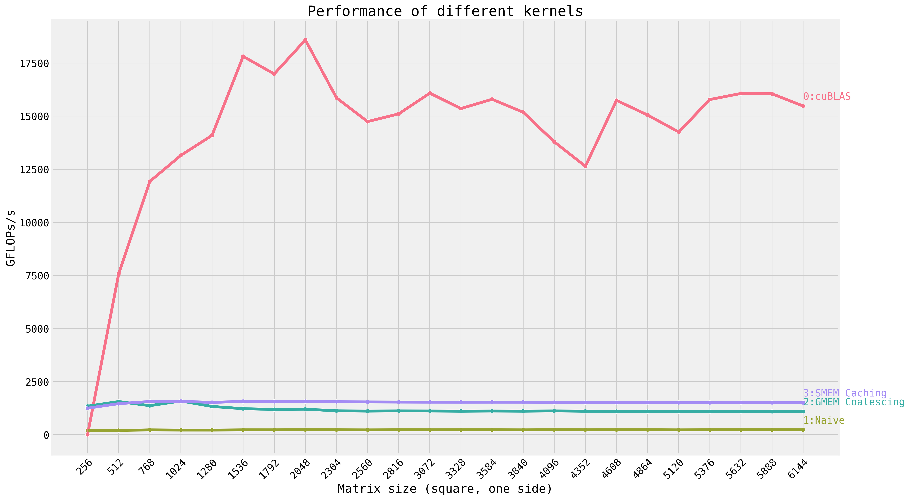
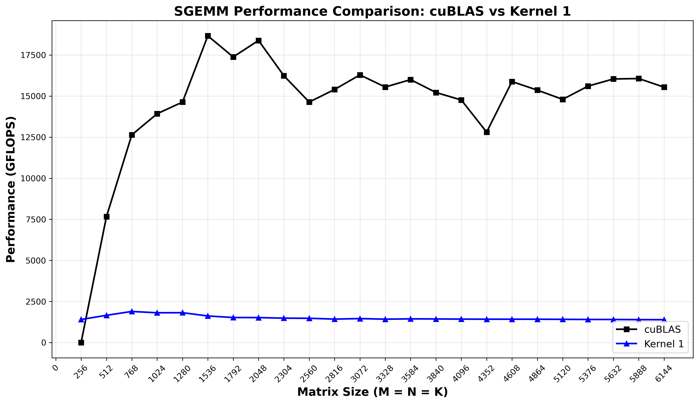

# SGEMM Optimization Practice

Progressive optimization of CUDA matrix multiplication kernels, from naive implementation to near-cuBLAS performance.

## Credits

- **Benchmarking framework & setup**: [wangzyon/NVIDIA_SGEMM_PRACTICE](https://github.com/wangzyon/NVIDIA_SGEMM_PRACTICE)
- **References & explanation**: [How to Optimize a CUDA Matmul Kernel for cuBLAS-like Performance](https://siboehm.com/articles/22/CUDA-MMM) by Simon Boehm

## Quick Start

```bash
# Build
./build.sh

# Run benchmarks
./sgemm 0    # cuBLAS baseline
./sgemm 1    # Naive kernel
./sgemm 2    # Shared memory tiling
# ... kernels 3-7

# Generate plots
python3 plot.py 0 1      # Compare two kernels
python3 plot.py          # Summary + all kernels
```

## Performance Results

### Overview - All Kernels



This plot shows the performance progression across all implemented kernels. Each line represents a different optimization technique applied to the SGEMM operation.

### Kernel 0 vs Kernel 1 - cuBLAS vs Naive



**Results (NVIDIA A10)**:
- cuBLAS: ~14.6 TFLOPS avg, 18.7 TFLOPS peak
- Naive: ~1.5 TFLOPS avg, 1.9 TFLOPS peak
- Performance ratio: ~10% of cuBLAS
