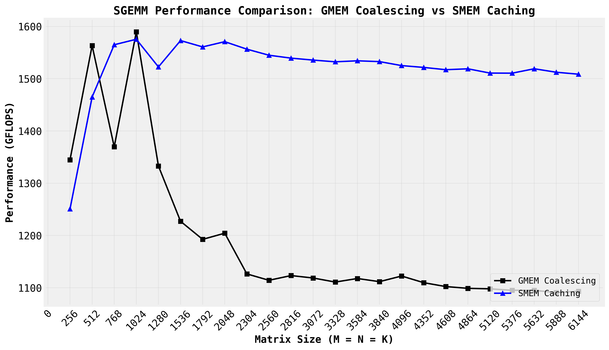

# SGEMM Optimization Practice

Progressive optimization of CUDA matrix multiplication kernels, from naive implementation to near-cuBLAS performance.

## Credits

- **Benchmarking framework & setup**: [wangzyon/NVIDIA_SGEMM_PRACTICE](https://github.com/wangzyon/NVIDIA_SGEMM_PRACTICE)
- **References & explanation**: [How to Optimize a CUDA Matmul Kernel for cuBLAS-like Performance](https://siboehm.com/articles/22/CUDA-MMM) by Simon Boehm

## Quick Start

```bash
# Build
./build.sh

# Run benchmarks
./sgemm 0    # cuBLAS baseline
./sgemm 1    # Naive kernel
./sgemm 2    # Shared memory tiling
# ... kernels 3-7

# Generate plots
python3 plot.py 0 1      # Compare two kernels
python3 plot.py          # Summary + all kernels
```

## Performance Results

### Overview - All Kernels


This plot shows the performance progression across all implemented kernels. Each line represents a different optimization technique applied to the SGEMM operation.

**Results (NVIDIA A10)**:
- cuBLAS: ~14.6 TFLOPS avg, 18.7 TFLOPS peak
- Naive: ~1.5 TFLOPS avg, 1.9 TFLOPS peak
- Performance ratio: ~10% of cuBLAS

### Kernel Progression: 1 → 2 → 3


**Kernel 1 (Naive)** → **Kernel 2 (GMEM Coalescing)**
- **5-7x speedup** from memory coalescing optimizations
- Kernel 1: ~230 GFLOPS avg
- Kernel 2: ~1,100-1,500 GFLOPS avg



**Kernel 2** → **Kernel 3 (SMEM Caching)**
- Currently experiencing performance regression (under investigation)
- See profiling analysis below for optimization opportunities

## Profiling Analysis - Kernel 3

NCU profiling of `mysgemm_v3<32>` reveals key bottlenecks and optimization opportunities:

### Performance Summary
- **Execution Time**: 109.73ms
- **Memory Throughput**: 84.51% utilization
- **Compute Throughput**: 84.51% utilization
- **Occupancy**: 66.67% (limited by 36 registers/thread)

### Critical Bottlenecks

#### 1. MIO (Memory I/O) Stalls - **PRIMARY ISSUE** (60.7% of stall time)
- Warps spend **22.6 cycles** stalled waiting for MIO queue
- Caused by **shared memory bank conflicts** or narrow memory accesses
- **Fix**: Use vectorized loads (`float4`) instead of scalar `float` loads

#### 2. Low Occupancy (66.67%)
```
Block Limit SM:         16 blocks
Block Limit Registers:   1 block  ← BOTTLENECK
Block Limit Shared Mem: 11 blocks
Block Limit Warps:       1 block
```
- Limited by **36 registers per thread**
- Only 1 block can run per SM due to register pressure
- **Target**: Reduce to <32 registers/thread for higher occupancy

#### 3. Poor Scheduler Utilization (21.49%)
- Only **0.96 eligible warps** per scheduler (out of 8 active)
- Schedulers issue 1 instruction every **4.7 cycles** (vs ideal 1 cycle)
- **78.51%** of cycles have no eligible warps

#### 4. Cache Performance
- **L1/TEX Hit Rate**: 0.39% (essentially bypassing L1)
- **L2 Hit Rate**: 48.96% (half the requests go to DRAM)
- **DRAM Throughput**: 16.92%

### Launch Configuration
```
Block Size:        1024 threads
Grid Size:         16,384 blocks
Shared Memory:     8.19 KB static/block
Registers/Thread:  36
Waves Per SM:      227.56
```
